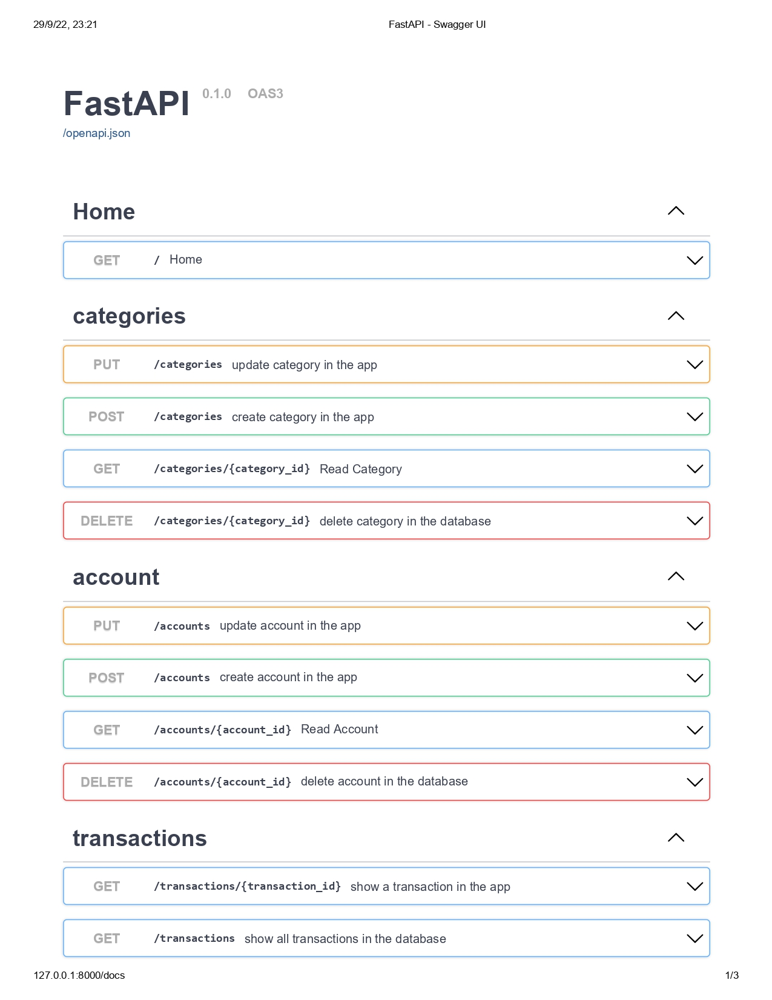
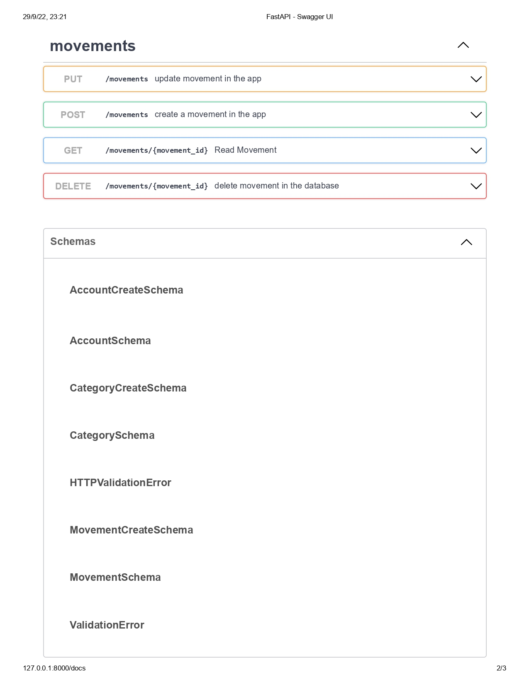

Run Backend
```
uvicorn personal_admon_backend.api.api:app --reload
```

Run Backend with ORM
```
uvicorn personal_admon_backend.orm.main:app --reload
```

Run Backend personal finance
```
uvicorn personal_finance.api:app --reload

## Swagger UI


